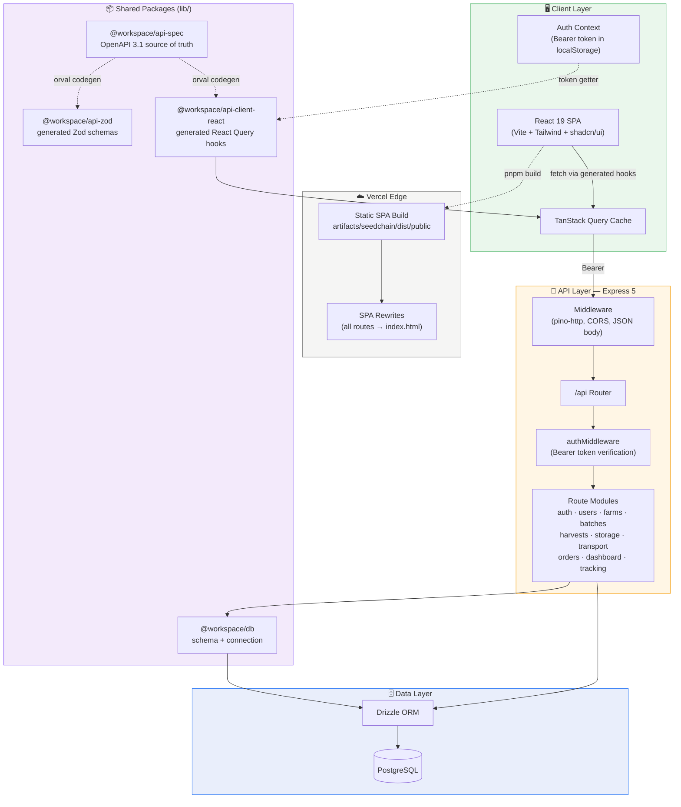
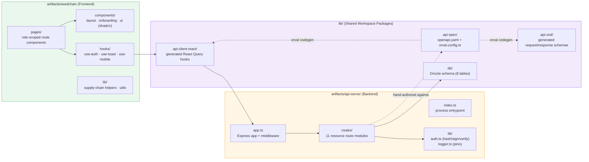
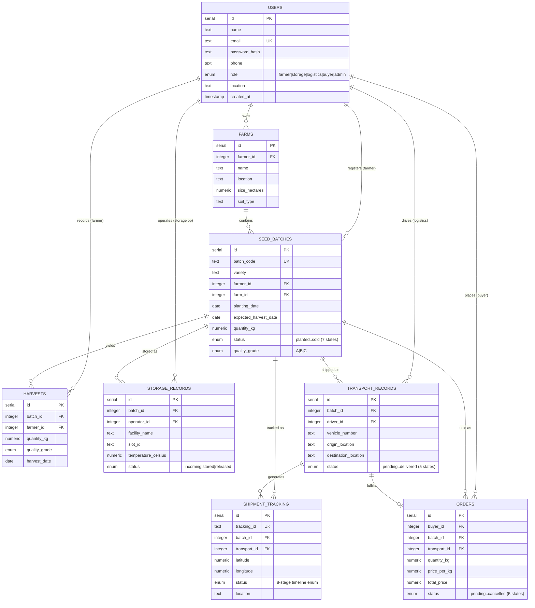
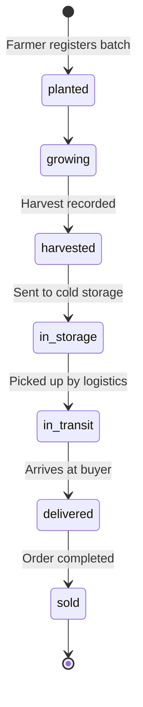
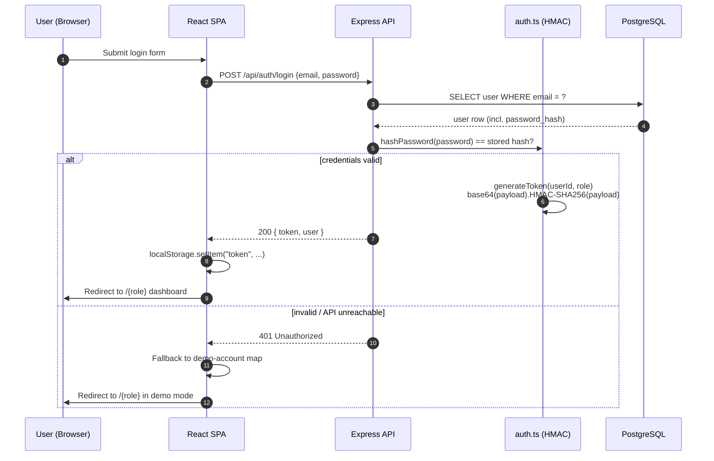
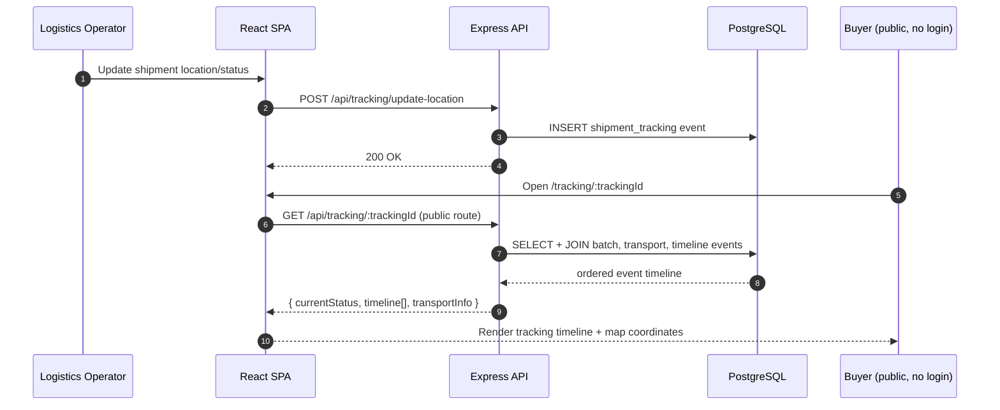
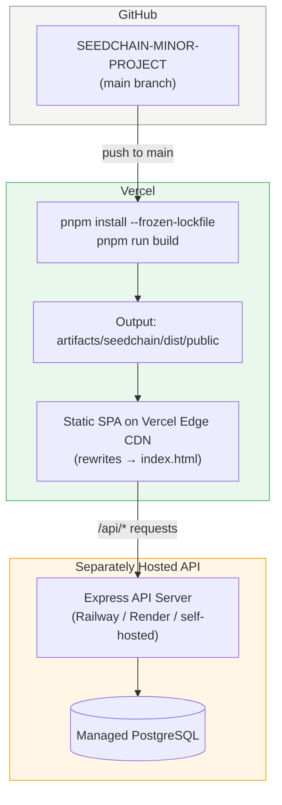

<div align="center">

# 🌱 SeedChain

### Digital Supply Chain Tracking for Agriculture — From Farm to Buyer

**A full-stack traceability platform that gives every potato seed batch a digital identity — trackable, transparent, and tamper-evident from the field to the final buyer.**

[](https://www.typescriptlang.org/)
[](https://react.dev/)
[](https://expressjs.com/)
[](https://orm.drizzle.team/)
[](https://vitejs.dev/)
[](https://pnpm.io/)
[](https://seedchain.vercel.app)
[](#-license)

[**Live Demo**](https://seedchain.vercel.app) · [**Report Bug**](../../issues) · [**Request Feature**](../../issues)

</div>

<br/>

> **Note on this README:** This documentation reflects the *actual* implementation in this repository (Express + Drizzle ORM + PostgreSQL, custom signed-token auth), not the earlier Supabase-based direction referenced in some legacy setup notes. See [Design Decisions](#-design-decisions--rationale) for why the stack evolved.

<br/>

## 📖 Table of Contents

- [Overview](#-overview)
- [The Problem](#-the-problem)
- [The Solution](#-the-solution)
- [Feature Highlights](#-feature-highlights)
- [User Roles & Capabilities](#-user-roles--capabilities)
- [Tech Stack](#-tech-stack)
- [System Architecture](#-system-architecture)
- [Application / Module Architecture](#-application--module-architecture)
- [Database Design (ER Diagram)](#-database-design-er-diagram)
- [Core Workflows](#-core-workflows)
  - [Batch Lifecycle (State Machine)](#batch-lifecycle-state-machine)
  - [Authentication Sequence](#authentication-sequence)
  - [Shipment Tracking Sequence](#shipment-tracking-sequence)
  - [End-to-End Supply Chain Flow](#end-to-end-supply-chain-flow)
- [Folder Structure](#-folder-structure)
- [API Reference](#-api-reference)
- [Getting Started](#-getting-started)
- [Environment Variables](#-environment-variables)
- [Deployment](#-deployment)
- [Design Decisions & Rationale](#-design-decisions--rationale)
- [Challenges & Lessons Learned](#-challenges--lessons-learned)
- [Known Limitations](#-known-limitations)
- [Roadmap](#-roadmap)
- [Contributing](#-contributing)
- [License](#-license)
- [Author](#-author)

<br/>

## 🌱 Overview

**SeedChain** is a role-based, full-stack SaaS platform that digitizes the agricultural supply chain for potato seed batches. It connects five stakeholders — **farmers, cold storage operators, logistics providers, buyers, and administrators** — into a single system of record, so that a crop batch can be traced, event by event, from the moment it's planted to the moment it's delivered.

It was built as a monorepo with a **React + Vite** frontend and an **Express + PostgreSQL (Drizzle ORM)** backend, using an OpenAPI-first workflow to keep the client and server types in sync.

<br/>

## 🚜 The Problem

Traditional agricultural supply chains are largely undocumented:

```
Farmer → Cold Storage → Logistics → Buyer
```

At every arrow in that chain, information is lost. There's typically **no digital record** of what moved, when, in what condition, or who touched it — which leads to:

- ❌ Crop mismanagement and spoilage that nobody can trace back to a cause
- ❌ Delayed deliveries with no visibility into where a shipment actually is
- ❌ No accountability when quality disputes arise between parties
- ❌ Buyers and regulators unable to verify the origin or handling of produce

<br/>

## ✅ The Solution

SeedChain assigns every seed batch a **unique digital identity** (e.g. `BATCH-2026-001`) the moment it's registered, and records a structured, timestamped event for every stage it passes through:

```
Seed Batch → Farmer Registration → Harvest Record → Cold Storage Entry
           → Logistics Transport → Buyer Order → Shipment Delivery
```

Each event is written to a relational database via a typed API, so any stakeholder — or a buyer with just a tracking ID and no login — can see a batch's complete, ordered history.

<br/>

## ✨ Feature Highlights

| Feature | Description |
|---|---|
| 🆔 **Batch Identity System** | Every seed batch gets a unique `batchCode` that follows it through the entire chain |
| 🔳 **QR Code Generation** | Batches and shipments are rendered as scannable QR codes (`qrcode.react`) for quick lookup |
| 🗺️ **Public Shipment Tracking** | Anyone with a tracking ID can view a shipment's live timeline — no login required |
| 📊 **Role-Based Dashboards** | Five distinct dashboards (Farmer, Storage, Logistics, Buyer, Admin), each with metrics relevant to that role |
| 🛒 **Marketplace** | Buyers browse available batches and place orders directly against farmer inventory |
| 🔐 **Token-Based Auth** | Signed Bearer tokens gate role-specific routes on both the API and the client |
| 🧭 **Supply Chain Pipeline View** | Admins get an aggregate, stage-by-stage view of everything moving through the system |
| 🌐 **Graceful Offline/Demo Mode** | If the API is unreachable, the client falls back to demo accounts so the UI stays explorable |
| 🧾 **Typed API Contract** | The entire API surface is defined once in OpenAPI and code-generated into client hooks and server Zod schemas |

<br/>

## 👥 User Roles & Capabilities

<table>
<tr><th>Role</th><th>Route</th><th>Capabilities</th></tr>
<tr>
<td>👨‍🌾 <b>Farmer</b></td>
<td><code>/farmer</code></td>
<td>Register seed batches, record harvests, send batches to storage, list crops on the marketplace, track outgoing shipments</td>
</tr>
<tr>
<td>🧊 <b>Cold Storage Operator</b></td>
<td><code>/storage</code></td>
<td>Accept incoming batches, manage facility inventory, release batches for onward delivery</td>
</tr>
<tr>
<td>🚚 <b>Logistics Operator</b></td>
<td><code>/logistics</code></td>
<td>Accept delivery jobs, update pickup/location/delivery status, view active deliveries</td>
</tr>
<tr>
<td>🛒 <b>Buyer</b></td>
<td><code>/buyer</code></td>
<td>Browse the marketplace, place orders, track incoming deliveries in real time</td>
</tr>
<tr>
<td>🧑‍💼 <b>Admin</b></td>
<td><code>/admin</code></td>
<td>Oversee users, batches, and storage facilities; view an aggregate supply chain pipeline view</td>
</tr>
</table>

Routing is enforced by a `ProtectedRoute` wrapper that checks `isAuthenticated` and the current user's `role` against an `allowedRoles` whitelist per route, redirecting unauthorized users back to their own dashboard.

<br/>

## 🛠 Tech Stack

<table>
<tr>
<td valign="top" width="33%">

**Frontend**
- React 19 + TypeScript
- Vite 7
- Tailwind CSS 4
- shadcn/ui (Radix primitives)
- Framer Motion + GSAP
- TanStack Query (React Query)
- Wouter (routing)
- React Hook Form + Zod
- Recharts
- `qrcode.react`

</td>
<td valign="top" width="33%">

**Backend**
- Node.js 24
- Express 5
- Drizzle ORM
- PostgreSQL
- Zod (`drizzle-zod`)
- Pino / `pino-http` (structured logging)
- HMAC-SHA256 signed tokens (custom auth)
- esbuild (production bundle)

</td>
<td valign="top" width="33%">

**Tooling & Infra**
- pnpm workspaces (monorepo)
- TypeScript project references
- OpenAPI 3.1 spec (`lib/api-spec`)
- Orval (API client + Zod codegen)
- Vercel (frontend hosting)
- Vite dev proxy (`/api` → Express)

</td>
</tr>
</table>

<br/>

## 🏗 System Architecture



**Request path in development:** the Vite dev server proxies every `/api/*` request straight to the Express server on port `8080` (see `vite.config.ts`), so the frontend always talks to `/api/...` regardless of environment.

<br/>

## 🧩 Application / Module Architecture



Each backend route module (`routes/batches.ts`, `routes/tracking.ts`, etc.) owns exactly one resource, imports only the Drizzle tables it needs from `@workspace/db`, and is composed into a single router in `routes/index.ts` — a deliberately flat, easy-to-navigate structure over a deeply nested MVC layout.

<br/>

## 🗃 Database Design (ER Diagram)

The schema is defined with Drizzle ORM (`lib/db/src/schema/*.ts`) and pushed directly to PostgreSQL — eight tables model the entire batch lifecycle:



<br/>

## 🔄 Core Workflows

### Batch Lifecycle (State Machine)

`seed_batches.status` drives the primary lifecycle of a batch:



In parallel, `shipment_tracking.status` records a finer-grained, publicly viewable timeline for a shipment once it's in motion:

```
order_created → accepted_by_logistics → picked_up_from_farm
→ arrived_at_cold_storage → stored → picked_up_for_delivery
→ in_transit → delivered_to_buyer
```

### Authentication Sequence



Every subsequent request attaches `Authorization: Bearer <token>`; `authMiddleware` re-derives the HMAC signature, rejects mismatches, and re-fetches the user from PostgreSQL before allowing the route handler to run.

### Shipment Tracking Sequence



The tracking-lookup endpoint is intentionally left **outside** `authMiddleware` — traceability is a transparency feature, so anyone holding a tracking ID (e.g. via a scanned QR code) can view a shipment's history without an account.

### End-to-End Supply Chain Flow

```mermaid
flowchart LR
    A["👨‍🌾 Farmer<br/>registers batch"] --> B["🌾 Harvest<br/>recorded"]
    B --> C["🧊 Sent to<br/>Cold Storage"]
    C --> D["📦 Storage accepts<br/>& holds inventory"]
    D --> E["🛒 Buyer places<br/>order on Marketplace"]
    E --> F["🚚 Logistics accepts<br/>delivery job"]
    F --> G["📍 Pickup + live<br/>location updates"]
    G --> H["✅ Delivered<br/>to Buyer"]
    H --> I["🔎 Full timeline visible<br/>via public tracking ID"]

    style A fill:#EAF7EC,stroke:#3FAF5E
    style H fill:#EAF7EC,stroke:#3FAF5E
    style I fill:#F5F5F4,stroke:#8f8f8f
```



<br/>

## 📁 Folder Structure

```
SEEDCHAIN-MINOR-PROJECT/
│
├── artifacts/                       # Deployable applications
│   ├── seedchain/                   # React + Vite frontend
│   │   ├── src/
│   │   │   ├── pages/                # Route-level components
│   │   │   │   ├── auth/             # login, register
│   │   │   │   ├── farmer/           # dashboard, batches, harvests, marketplace...
│   │   │   │   ├── storage/          # dashboard, inventory, incoming, outgoing
│   │   │   │   ├── logistics/        # dashboard, deliveries, tracking
│   │   │   │   ├── buyer/            # dashboard, marketplace, orders
│   │   │   │   └── admin/            # dashboard, users, batches, storage, map
│   │   │   ├── components/
│   │   │   │   ├── layout/           # dashboard-layout.tsx, navbar.tsx
│   │   │   │   ├── onboarding/       # role setup flows
│   │   │   │   └── ui/               # shadcn/ui primitives
│   │   │   ├── hooks/                # use-auth, use-toast, use-mobile
│   │   │   ├── lib/                  # supply-chain helpers, utils
│   │   │   ├── App.tsx               # route table + ProtectedRoute
│   │   │   └── main.tsx              # entrypoint, sets base URL + auth token getter
│   │   └── vite.config.ts            # dev proxy: /api → localhost:8080
│   │
│   ├── api-server/                  # Express backend
│   │   └── src/
│   │       ├── routes/                # auth, users, farms, batches, harvests,
│   │       │                          # storage, transport, orders, dashboard, tracking
│   │       ├── lib/                   # auth.ts (HMAC), logger.ts (pino)
│   │       ├── app.ts                 # middleware + router mounting
│   │       └── index.ts               # process entrypoint (reads $PORT)
│   │
│   └── mockup-sandbox/              # Internal design/prototype sandbox (excluded from prod build)
│
├── lib/                              # Shared workspace packages
│   ├── db/                          # Drizzle schema + PostgreSQL connection
│   │   └── src/schema/               # users, farms, batches, harvests,
│   │                                  # storage, transport, orders, tracking
│   ├── api-spec/                    # OpenAPI 3.1 spec (source of truth) + Orval config
│   ├── api-zod/                     # Generated Zod request/response schemas
│   └── api-client-react/            # Generated React Query hooks
│
├── scripts/                          # Repo automation (e.g. post-merge hook)
├── attached_assets/                  # Design references
├── pnpm-workspace.yaml               # Workspace + dependency catalog
├── vercel.json                       # Vercel monorepo build config
├── package.json                      # Root scripts (build, typecheck)
└── README.md
```

<br/>

## 📡 API Reference

All endpoints are namespaced under `/api` and defined in `lib/api-spec/openapi.yaml`, which is the single source of truth code-generated into both the client hooks and server-side Zod types via **Orval**. 🔒 = requires `Authorization: Bearer <token>`.

<details>
<summary><b>Auth</b></summary>

| Method | Endpoint | Description |
|---|---|---|
| `POST` | `/api/auth/register` | Create a user account for a given role |
| `POST` | `/api/auth/login` | Authenticate and receive a signed Bearer token |
| `GET` 🔒 | `/api/auth/me` | Return the currently authenticated user |

</details>

<details>
<summary><b>Users, Farms & Batches</b></summary>

| Method | Endpoint | Description |
|---|---|---|
| `GET` 🔒 | `/api/users` | List users |
| `GET` 🔒 | `/api/users/:id` | Get a user by ID |
| `PUT` 🔒 | `/api/users/:id` | Update a user profile |
| `GET` 🔒 | `/api/farms` | List farms |
| `POST` 🔒 | `/api/farms` | Register a new farm |
| `GET` 🔒 | `/api/farms/:id` | Get a farm by ID |
| `GET` 🔒 | `/api/batches` | List seed batches |
| `POST` 🔒 | `/api/batches` | Register a new seed batch |
| `GET` 🔒 | `/api/batches/:id` | Get a batch by ID |
| `PUT` 🔒 | `/api/batches/:id` | Update batch status/details |

</details>

<details>
<summary><b>Harvests, Storage & Transport</b></summary>

| Method | Endpoint | Description |
|---|---|---|
| `GET` 🔒 | `/api/harvests` | List harvest records |
| `POST` 🔒 | `/api/harvests` | Record a new harvest |
| `GET` 🔒 | `/api/harvests/:id` | Get a harvest by ID |
| `GET` 🔒 | `/api/storage` | List cold storage records |
| `POST` 🔒 | `/api/storage` | Log an incoming storage entry |
| `GET` 🔒 | `/api/storage/:id` | Get a storage record by ID |
| `PUT` 🔒 | `/api/storage/:id` | Update a storage record (e.g. release) |
| `GET` 🔒 | `/api/transport` | List transport/delivery jobs |
| `POST` 🔒 | `/api/transport` | Create a transport job |
| `GET` 🔒 | `/api/transport/:id` | Get a transport record by ID |
| `PUT` 🔒 | `/api/transport/:id` | Update transport status |

</details>

<details>
<summary><b>Orders, Dashboard & Tracking</b></summary>

| Method | Endpoint | Description |
|---|---|---|
| `GET` 🔒 | `/api/orders` | List orders |
| `POST` 🔒 | `/api/orders` | Place a new order |
| `GET` 🔒 | `/api/orders/:id` | Get an order by ID |
| `PUT` 🔒 | `/api/orders/:id` | Update order status |
| `GET` 🔒 | `/api/marketplace` | Browse purchasable batches |
| `GET` 🔒 | `/api/dashboard/summary` | Aggregate platform-wide metrics |
| `GET` 🔒 | `/api/dashboard/farmer/:userId` | Farmer-specific dashboard data |
| `GET` 🔒 | `/api/dashboard/storage/:userId` | Storage-operator dashboard data |
| `GET` 🔒 | `/api/dashboard/logistics/:userId` | Logistics dashboard data |
| `GET` 🔒 | `/api/dashboard/buyer/:userId` | Buyer dashboard data |
| `GET` | `/api/tracking/:trackingId` | **Public** — full shipment timeline |
| `POST` 🔒 | `/api/tracking` | Create a tracking record |
| `POST` 🔒 | `/api/tracking/update-location` | Push a GPS coordinate update |
| `POST` 🔒 | `/api/tracking/update-status` | Advance a shipment's status |
| `GET` 🔒 | `/api/shipments/user/:userId` | Shipments relevant to a given user |
| `GET` 🔒 | `/api/tracking/all/active` | All currently active shipments (admin) |
| `GET` | `/health`, `/api/healthz` | Liveness checks |

</details>

<br/>

## 🚀 Getting Started

### Prerequisites

- **Node.js** ≥ 24
- **pnpm** (this repo enforces pnpm via a `preinstall` guard — npm/yarn lockfiles are rejected)
- A **PostgreSQL** database (local or hosted, e.g. Neon/Railway/Supabase-Postgres)

### Installation

```bash
# 1. Clone the repository
git clone https://github.com/Tisha1169/SEEDCHAIN-MINOR-PROJECT.git
cd SEEDCHAIN-MINOR-PROJECT

# 2. Install dependencies (pnpm workspaces — installs all packages at once)
pnpm install

# 3. Configure environment variables (see below), then push the DB schema
pnpm --filter @workspace/db run push

# 4. Run the API server (port 8080)
pnpm --filter @workspace/api-server run dev

# 5. In a second terminal, run the frontend (port 5173, proxies /api → :8080)
pnpm --filter @workspace/seedchain run dev
```

The app is now available at `http://localhost:5173`.

### Demo Credentials

| Role | Email | Password |
|---|---|---|
| Admin | `admin@seedchain.io` | `admin123` |
| Farmer | `rajesh@farmer.com` | `farmer123` |
| Farmer | `priya@farmer.com` | `farmer123` |
| Cold Storage | `storage@coolstore.com` | `storage123` |
| Logistics | `driver@fastlogistics.com` | `logistics123` |
| Buyer | `buyer@greenmart.com` | `buyer123` |

### Useful Commands

| Command | Purpose |
|---|---|
| `pnpm run typecheck` | Full monorepo type-check |
| `pnpm run build` | Type-check + build every package |
| `pnpm --filter @workspace/api-spec run codegen` | Regenerate API hooks & Zod schemas from `openapi.yaml` |
| `pnpm --filter @workspace/db run push` | Push Drizzle schema changes to PostgreSQL (dev only) |
| `pnpm --filter @workspace/api-server run dev` | Run the API server locally |

<br/>

## 🔑 Environment Variables

**`lib/db` / `artifacts/api-server`**

| Variable | Required | Description |
|---|---|---|
| `DATABASE_URL` | ✅ | PostgreSQL connection string |
| `PORT` | ✅ | Port the API server listens on (e.g. `8080`) |
| `SESSION_SECRET` | recommended | HMAC signing secret for auth tokens (defaults to an insecure fallback if unset) |
| `FRONTEND_URL` | optional | Where non-API requests redirect to |

**`artifacts/seedchain`**

| Variable | Required | Description |
|---|---|---|
| `PORT` | optional | Dev server port (defaults to `5173`) |
| `BASE_PATH` | optional | Base path for the Vite build (defaults to `/`) |

> ⚠️ Never commit real values for these — use `.env` files locally (already `.gitignore`d) and your hosting provider's secrets manager in production.

<br/>

## ☁️ Deployment

SeedChain's frontend is deployed on **Vercel** as a static SPA; the API/database currently need to be hosted separately (e.g. Railway, Render, or Vercel serverless functions) since Vercel's static hosting doesn't run a long-lived Express process.



**Vercel project settings** (from `vercel.json` at the repo root):

| Setting | Value |
|---|---|
| Framework Preset | Vite |
| Build Command | `pnpm run build` |
| Output Directory | `artifacts/seedchain/dist/public` |
| Install Command | `pnpm install --frozen-lockfile` |

Steps:
1. Import the repository into Vercel.
2. Leave the root directory as the monorepo root — `vercel.json` already points at the correct build/output paths.
3. Add the frontend's environment variables in **Project → Settings → Environment Variables**.
4. Deploy the API server to a Node-friendly host with PostgreSQL support (Railway/Render), and point the frontend at it — either via a proxy rewrite or by setting the client's base API URL.
5. Push to `main` — Vercel auto-deploys on every push.

<br/>

## 🎯 Design Decisions & Rationale

| Decision | Rationale |
|---|---|
| **pnpm monorepo** (`artifacts/*`, `lib/*`) | Keeps the frontend, backend, and shared types in one repo with one lockfile, so a schema change in `lib/db` is immediately visible to both the API and the generated client — no version drift between packages. |
| **OpenAPI + Orval codegen** (`lib/api-spec` → `lib/api-client-react`, `lib/api-zod`) | The API contract is written once as YAML and generated into typed React Query hooks and Zod validators, instead of hand-writing (and re-writing) fetch calls and types on both sides. |
| **Drizzle ORM over Prisma/raw SQL** | Drizzle's schema is plain TypeScript (`pgTable(...)`), which keeps table definitions, `drizzle-zod` insert schemas, and inferred types co-located in one file per resource — easy to read end-to-end. |
| **Custom HMAC-signed tokens instead of a third-party auth provider** | Keeps auth self-contained within the Express server with no external dependency for a project of this scope — a deliberate trade-off explained further in [Known Limitations](#-known-limitations). |
| **Wouter instead of React Router** | A ~1.5KB router was enough for this route table's needs, keeping the client bundle lean. |
| **Client-side demo-mode fallback** (`use-auth.tsx`) | If the API is temporarily unreachable (e.g. during a cold start on a free-tier host), the UI still logs in with seeded demo accounts so reviewers/recruiters can explore the product without a live backend. |
| **Public, unauthenticated tracking endpoint** | Traceability is the core value proposition — gating it behind a login would defeat the purpose for a buyer who only has a QR-scanned tracking ID. |
| **Flat route-module structure** (`routes/batches.ts`, `routes/orders.ts`, …) | One file per resource, all mounted through a single `routes/index.ts`, avoids over-engineering a small API with layers (controllers/services/repositories) it doesn't yet need. |

<br/>

## 🧗 Challenges & Lessons Learned

- **Replacing mock data with a real backend.** The frontend originally shipped with hard-coded dummy data across dashboards; a later pass (`Fix: Replace all dummy data with real backend API calls`) rewired every page to the generated React Query hooks, added loading states, and wired up cache invalidation — a good reminder that UI built ahead of an API needs a deliberate integration pass, not just a data-source swap.
- **Vercel + pnpm monorepo output paths.** Vercel's default output-directory assumptions don't match a nested workspace layout; getting `outputDirectory: artifacts/seedchain/dist/public` and the build/install commands right took a few iterations (see `VERCEL_TROUBLESHOOTING.md`).
- **Splitting the frontend and backend deploy targets.** Vercel's static hosting is a natural fit for the Vite SPA but not for a long-running Express + PostgreSQL process — the deployment story had to be split into a static frontend plus a separately hosted API.
- **Auth evolution.** The project moved from an early Supabase-auth direction to a self-contained Express + HMAC-token implementation, trading a managed auth provider for full control over the user/role model that the rest of the schema depends on.

<br/>

## ⚠️ Known Limitations

Being transparent about trade-offs made for a time-boxed academic project:

- **Password hashing** uses HMAC-SHA256 with a shared secret rather than a dedicated password-hashing algorithm (bcrypt/argon2/scrypt) — fine for a demo, not production-grade for real credentials.
- **Tokens don't expire** and there's no refresh/revocation flow — a lost token remains valid indefinitely.
- **RFID scanning is simulated** (a generated ID string), not integrated with real hardware.
- **Shipment location updates are manual**, not sourced from live GPS/IoT devices.
- **No automated test suite** currently covers the API routes or React components.

<br/>

## 🗺 Roadmap

- [ ] Move password hashing to bcrypt/argon2 and add token expiry + refresh
- [ ] Automated test coverage (API integration tests + component tests)
- [ ] Real RFID/QR hardware integration for storage and logistics operators
- [ ] IoT sensor ingestion (temperature/humidity) from cold storage facilities
- [ ] Predictive analytics for supply chain throughput and spoilage risk
- [ ] Blockchain-anchored batch history for tamper-evident traceability
- [ ] AI-assisted demand forecasting for buyers and farmers
- [ ] Consolidated deployment (frontend + backend) on a single platform

<br/>

## 🤝 Contributing

Contributions are welcome!

1. Fork the repository
2. Create a feature branch: `git checkout -b feat/your-feature`
3. Run `pnpm run typecheck` before committing
4. Commit with a clear message and open a Pull Request

If you're changing the API surface, update `lib/api-spec/openapi.yaml` first and regenerate clients with `pnpm --filter @workspace/api-spec run codegen` so the frontend and backend stay in sync.

<br/>

## 📄 License

Licensed under the **MIT License**.

<br/>

## 👩‍💻 Author

**Tisha Dubey**
B.Tech, Industrial & Production Engineering — NIT Jalandhar

Project: *SeedChain — Agricultural Supply Chain Tracking Platform*

<br/>

<div align="center">

If SeedChain was useful or interesting to you, consider ⭐ starring the repo.

</div>
